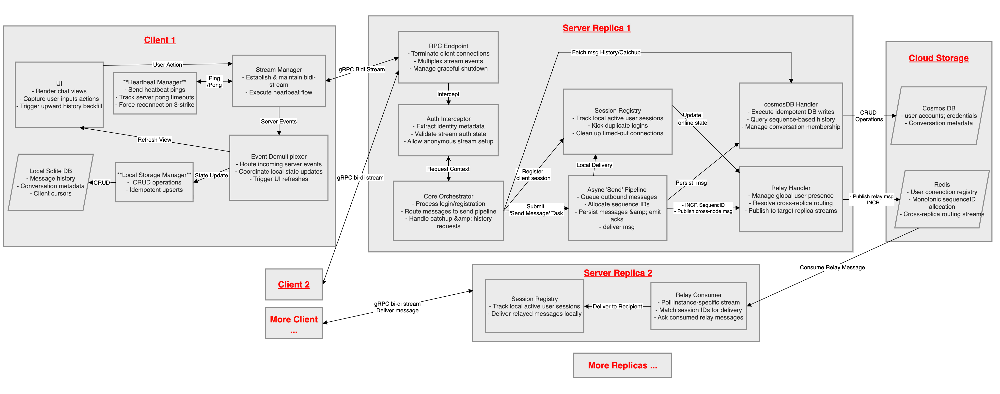
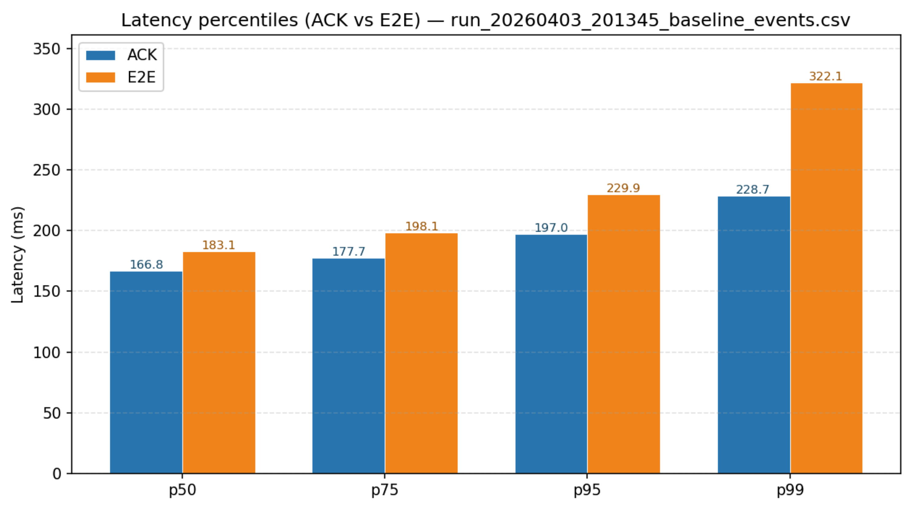
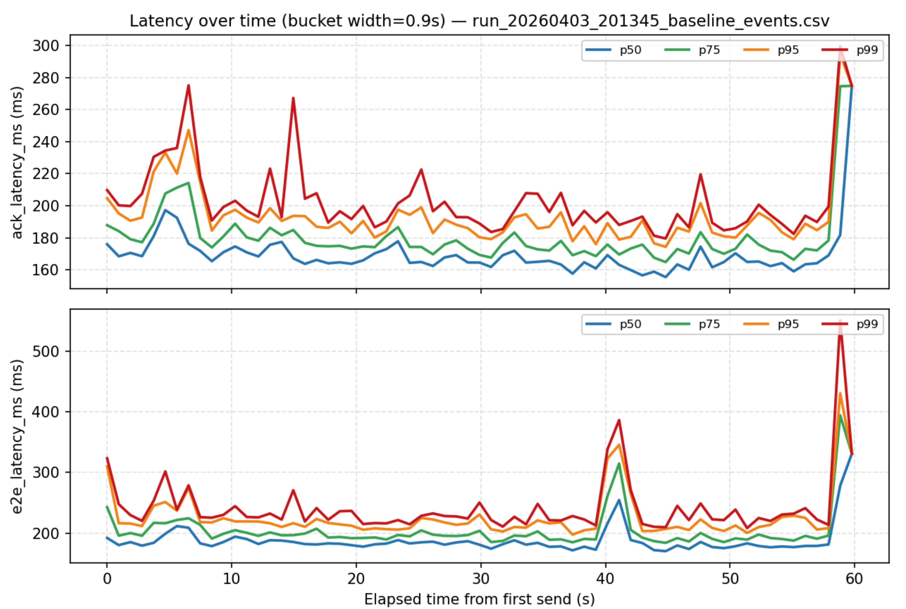

# Distributed Messaging System

> A **Java 17 distributed messaging system** built with **Spring Boot, bidirectional gRPC, Protocol Buffers, Redis, Azure Cosmos DB, and SQLite**—designed for persistence-first acknowledgements, cross-replica delivery, and reconnect recovery.

The project implements an end-to-end one-to-one chat stack: a horizontally replicable server, a stateful desktop client, a language-neutral streaming protocol, durable cloud persistence, and ephemeral routing coordination. It focuses on the engineering problems behind real messaging systems—delivery semantics, idempotency, ordering, backpressure, session liveness, local caching, and recovery after missed live delivery.

## 1. System at a Glance

| Area | Implementation |
| --- | --- |
| **Server** | Java 17 · Spring Boot 3 · gRPC Java · configurable fixed worker pool · bounded send queue |
| **Wire protocol** | Protocol Buffers · one long-lived bidirectional stream · multiplexed auth, messaging, heartbeat, catch-up, and history events |
| **Durable state** | Azure Cosmos DB for users, conversations, and canonical messages |
| **Distributed coordination** | Redis presence with TTL · atomic per-conversation sequence allocation · Redis Streams cross-replica relay |
| **Desktop client** | Java Swing · reconnect and heartbeat scheduling · SQLite message cache and synchronization cursors |
| **Runtime** | Multi-module Maven build · multi-stage Docker image · environment-driven Spring profiles · non-root container process |

## 2. Architecture



Each client maintains one long-lived gRPC stream to a server replica. Replicas own only their local live sessions; Cosmos DB remains the durable source of truth, while Redis answers two ephemeral questions: which replica currently owns a user session, and what sequence number should the next message receive?

The server is a replicated modular application rather than a microservice suite. Authentication, messaging orchestration, session management, persistence, and routing remain in one Spring Boot process with explicit internal boundaries.

## 3. Persistence-First Send Path

```text
ClientEvent.OutboundMessage
    -> authenticate sender and validate payload
    -> resolve recipient and conversation
    -> allocate per-conversation sequence ID in Redis
    -> derive deterministic server message ID
    -> persist canonical message in Cosmos DB
    -> acknowledge PERSISTED_PENDING_DELIVERY to sender
    -> deliver to a local session or relay through Redis Streams
```

The acknowledgement contract separates **durable acceptance** from **live delivery**. A sender receives `PERSISTED_PENDING_DELIVERY` only after the canonical Cosmos record exists. If the recipient is offline, connected to another replica, or misses the live relay, the persisted message remains recoverable through catch-up and history APIs.

Deterministic IDs derived from the authenticated sender and `clientMsgId` make retries converge on the same canonical message instead of creating duplicates.

## 4. Distributed Systems Engineering

### 4.1 Cross-replica routing


- Each replica maintains a local `ConcurrentHashMap<userId, UserSession>`.
- Redis presence values identify both the owning replica and the current session ID.
- Remote delivery is published to the target replica's Redis Stream and consumed through a replica-specific consumer group.
- The receiving replica verifies the target session ID before delivery, preventing a stale relay from reaching a replacement login.
- Redis relay failure does not invalidate the canonical Cosmos message; reconnect catch-up restores product-level delivery.

### 4.2 Ordering and sequence recovery

Redis allocates monotonically increasing sequence IDs per conversation through atomic increments. When a counter is absent, initialization consults the durable maximum stored in Cosmos before allocating the next value. The sequence ID becomes the shared ordering contract across live delivery, catch-up, history, and the local SQLite projection.

### 4.3 Backpressure and concurrency isolation

`SendAsyncExecutor` moves storage and routing work off the gRPC callback path. It uses a configurable fixed worker pool and a bounded `ArrayBlockingQueue` with capacity 30,000. Submission is non-blocking; saturation produces an explicit `OVERLOADED` acknowledgement instead of unbounded memory growth.

Per-session writes are synchronized because gRPC `StreamObserver` is not thread-safe, while different users can be delivered concurrently.

### 4.4 Session liveness

- Clients send heartbeat pings every 10 seconds and reconnect after three missed pong deadlines.
- Reconnect delay grows from one to five seconds with jitter.
- Server sessions expire after 30 seconds without a heartbeat.
- Redis presence uses the same 30-second TTL and is renewed by active sessions.
- Duplicate login replaces the previous local session without allowing the older stream to remove the new session.

## 5. Offline Recovery and Local State


The desktop client stores messages, conversation summaries, authenticated identity, and per-conversation cursors in SQLite. After authentication or reconnect, it sends cursor hints to the server and merges returned canonical messages through idempotent upserts.

Catch-up retrieves messages newer than the local cursor. Paged history retrieves older ranges when the user scrolls. Unique indexes on canonical server IDs and conversation sequence IDs prevent duplicated presentation when the same message arrives through live delivery, catch-up, or history.

## 6. Recorded Baseline

The checked-in 100-pair baseline artifacts report acknowledgement and end-to-end latency across a 60-second run:

| Percentile | Durable ACK | End-to-end delivery |
| --- | ---: | ---: |
| **p50** | 166.8 ms | 183.1 ms |
| **p75** | 177.7 ms | 198.1 ms |
| **p95** | 197.0 ms | 229.9 ms |
| **p99** | 228.7 ms | 322.1 ms |





These figures are repository baseline measurements, not production SLOs. The server also logs queue wait, worker execution, total send latency, active workers, queue depth, and accepted/completed/rejected counts for capacity analysis.

## 7. Protocol Contract

`chat.proto` defines one bidirectional `MessagingService.Chat` RPC. `ClientEvent` and `ServerEvent` use `oneof` envelopes so login, registration, messages, heartbeat, catch-up, history, acknowledgements, and errors share the same ordered stream without weakening payload typing.

Key protocol rules:

- The authenticated stream state—not the client payload—supplies sender identity.
- Message text is bounded to 4,096 characters.
- Catch-up defaults to 50 messages per conversation.
- Requested history pages are capped at 200 messages.
- Existing Protobuf field numbers and enum values form the compatibility boundary.

## 8. Code Map

```text
chat-proto/
  chat.proto                  Bidirectional gRPC service and event contracts

chat-server/
  MessagingServiceImpl       Authentication, send, catch-up, and history orchestration
  ConnectionRegistry         Local sessions, heartbeat expiry, and delivery routing
  SendAsyncExecutor          Bounded asynchronous send pipeline
  CosmosDBHandler            Durable users, conversations, and canonical messages
  RedisHandler               Presence, sequencing, and replica relay streams

chat-client/
  ChatClientSession          Stream lifecycle, authentication, reconnect, and requests
  ServerResponseHandler      Event demultiplexing and local reconciliation
  HeartbeatManager           Ping/pong deadlines and reconnect trigger
  DatabaseManager            SQLite cache, cursors, and idempotent message merge
  ChatWindow                 Swing UI and scroll-driven history loading
```

## 9. Build and Run

Prerequisites and local infrastructure setup are documented in the [local development guide](specs/local-development-guide.md).

Build all Maven modules:

```bash
mvn clean verify
```

The server Dockerfile compiles the Maven reactor with Temurin 17 and runs the Spring Boot JAR on Amazon Corretto 17 as a non-root user.

## 10. Design References

- [Code-aligned architectural specification](specs/project_specs.md)
- [Cross-replica routing design](specs/node_routing_design.md)
- [Heartbeat and reconnect design](specs/heartbeat_design.md)
- [Catch-up and history design](specs/catchup_history_message_design.md)
- [Message persistence design](specs/message_persistency_design_v2.md)
- [Client conversation-history design](specs/conversation_history_frontend_design.md)
- [Login and registration design](specs/login_register_design.md)

## 11. Project Context

Distributed Messaging System is an independent software engineering project focused on conventional backend and distributed-systems fundamentals: explicit wire contracts, concurrency control, persistence semantics, horizontal scale-out, failure recovery, local synchronization, containerization, and measurable system behavior.
