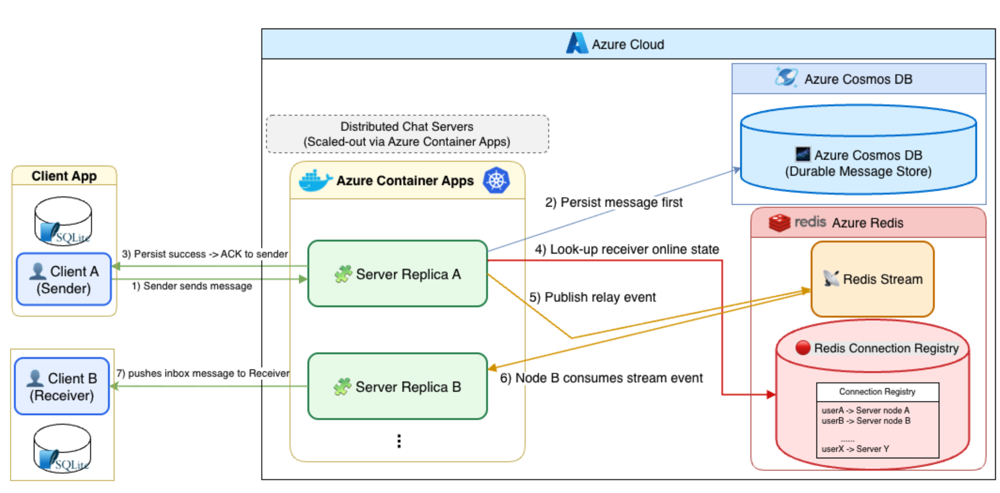
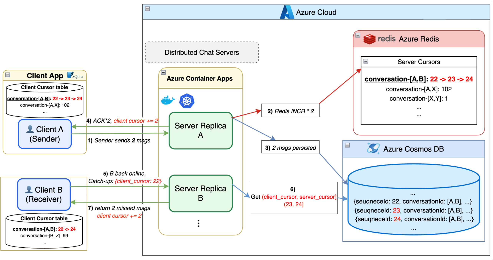

> An end-to-end **real-time, one-to-one chat** system designed to run as **multiple server replicas** behind cloud infrastructure. 
Clients keep a **long-lived bidirectional gRPC stream** for login, messaging, heartbeats, and synchronization; 
The server coordinates **durable storage**, **online presence**, and **cross-replica message delivery** so conversations stay consistent across disconnects and scale-out deployments.

## Overview

The project delivers a full chat stack: **live message exchange** with **acknowledgements tied to persistence**, and **recovery after outages** through **catch-up** and **paged history**. A **desktop client** maintains a **local database** for conversation state and scroll-driven history, while **server replicas** share routing and relay responsibilities through a **distributed cache layer**.

### Highlights

- **Cross-replica routing**  
  Senders and recipients may attach to different server instances. The system resolves where each user is connected and forwards live traffic accordingly, while still relying on durable storage as the source of truth.

  

- **Heartbeat and session liveness**  
  The client periodically signals that the stream is healthy; the server treats presence and sessions as time-bounded so stale connections can be cleaned up and clients can reconnect predictably.

- **Catch-up and history**  
  After a gap (offline time or reconnect), the client can request **missed messages** using per-conversation **sequence cursors**, and load **older pages** when the user scrolls. The diagram below summarizes the **cursor-based catch-up** idea: local state is reconciled against the server’s view of each conversation.

  

---

## Technology profile

This repository is intended to read like a **small distributed product**, not a toy single-node demo.

| Area | What you will find |
|------|-------------------|
| **Protocol and API** | **gRPC** with **Protocol Buffers**; a single bidirectional streaming RPC multiplexing auth, chat, heartbeats, and sync-style requests. |
| **Server** | **Java 17**, **Spring Boot**, integration with **Azure Cosmos DB** for durable users, conversations, and messages, and **Redis** for presence, sequencing, and replica-to-replica relay. |
| **Client** | **Java** desktop UI (**Swing**), **gRPC** client, **SQLite** for local messages, conversations, and sync cursors, with reconnect and background coordination. |
| **Cloud / ops context** | Configuration and deployment patterns aligned with **containerized** runs (e.g. Azure-oriented profiles and environment-driven settings). |

Together, these pieces show experience building: **streaming APIs**, **async server-side pipelines**, **document-store persistence**, **in-memory coordination for scale-out**, and **offline-friendly client state**—the kind of stack common in **messaging**, **SaaS backends**, and **cloud-native services**.

---

## Run This Projehct

How to build and run the client and server locally: [specs/local-development-guide.md](specs/local-development-guide.md).

---

## References

In-repo specifications and write-ups (paths are relative to the repository root):

- [Architectural specification (code-aligned)](specs/output_specs.md)
- [System architecture (Mermaid overview)](specs/architecture_diagram.md)
- [Node and cross-replica routing](specs/node_routing_design.md)
- [Heartbeat design](specs/heartbeat_design.md)
- [Catch-up and history messaging](specs/catchup_history_message_design.md)
- [Login and registration](specs/login_register_design.md)
- [Message persistency](specs/message_persistency_design_v2.md)
- [Conversation history (client)](specs/conversation_history_frontend_design.md)