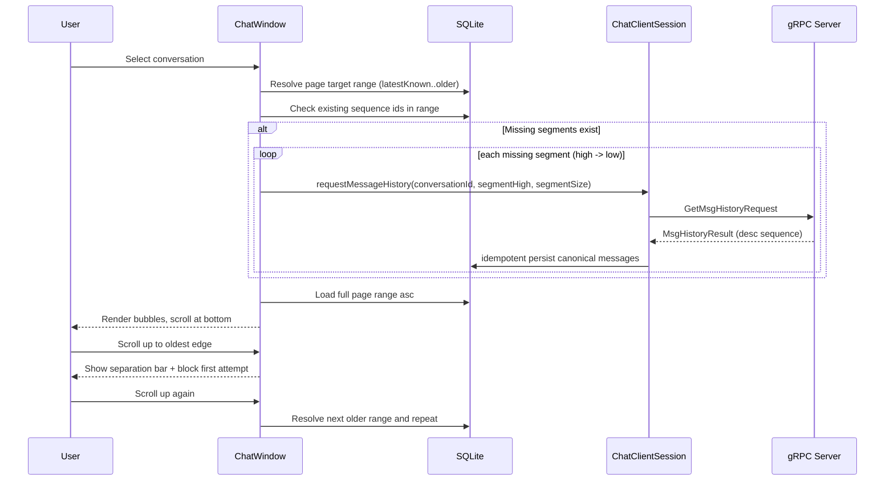

# Design: Client Conversation History Page (Scrollable + Dynamic Fetch)

## 1. Overview
This design refactors the client conversation page so one conversation timeline can be browsed with chat-style behavior: newest at bottom, older at top, left/right bubbles, and incremental history loading while scrolling upward. The fetch pipeline is sequence-based and combines local SQLite reads with server `GetMsgHistory` only for missing sequence segments.  
The separation bar uses a two-step gate: first upward reach at oldest edge blocks scroll and shows prompt text; only the next upward attempt triggers older-history fetch.



## 2. Data Models and APIs

### 2.1 Data Models
No server schema change is required for this feature. Client runtime state is added.

1. Existing SQLite tables used:
- `messages(conversation_id, sequence_id, ...)`
- `local_conversation_cursor(user_id, conversation_id, latest_message_sequence_id, updated_at_ms)`

2. New client runtime model (in-memory):
- `ConversationViewState`
  - `conversationId: String`
  - `latestKnownSequenceId: long` (from `local_conversation_cursor`)
  - `newestLoadedSequenceId: long`
  - `oldestLoadedSequenceId: long`
  - `historyExhausted: boolean`
  - `isFetchingHistory: boolean`
  - `separatorGateArmed: boolean` (first blocked attempt done)
  - `awaitingHistoryResponse: boolean`

3. Optional helper model:
- `SequenceSegment`
  - `highInclusive: long`
  - `lowInclusive: long`
  - `size(): int`

### 2.2 API Usage
1. `CatchupRequest`
- Used only for reconnect/login sync.
- Client persists returned messages and sets `local_conversation_cursor.latest_message_sequence_id = conversationLatestSequenceId`.

2. `GetMsgHistoryRequest`
- Request fields used:
  - `conversationId`
  - `beforeSequenceId` (inclusive upper bound in current API behavior)
  - `retriveMsgQuantity` (or generated `limit` setter depending on proto generation)
- Response:
  - `MsgHistoryResult(conversationId, messages[])`, messages descending by `sequenceId`.
- Important semantic note:
  - Server history query is inclusive (`sequenceId <= beforeSequenceId`).
  - Local helper `listMessagesBeforeSequence` uses exclusive bound (`sequence_id < beforeSequenceId`) for local reads.

3. API constraints for design:
- At most one in-flight history request per conversation to avoid response-to-request ambiguity (response has no request id).
- Range filling is done by sequential segment fetches (high to low).

## 3. Current vs Expected Behavior

### 3.1 `ChatWindow`
Current:
1. Already contains sequence-oriented runtime state and staged history loading scaffolding.
2. Uses conversation-scoped pending history tracking (`pendingHistoryFetchByConversation`) rather than stateless fire-and-forget.
3. `onHistoryResultSummary` is actively used to complete waiting fetch flows; `onCatchupResultSummary` is primarily informational/debug.
4. Bubble rendering uses fixed width with min/max height controls.

Expected:
1. Selection triggers sequence-based page resolve anchored by `latest_message_sequence_id`.
2. Scroll-up behavior:
- At oldest loaded edge and more history available: show separation bar and block first upward attempt.
- Second upward attempt triggers next older page load.
3. Renders timeline ordered by `sequenceId` ascending.
4. Bubble component uses min/max height and fixed width; displays `sequenceId` for debug.
5. Implements conversation-scoped state machine (`ConversationViewState`) and ignores stale async results when user switches conversation.

### 3.2 `ChatClientSession`
Current:
1. Has request methods for catchup/history and useful local DB query wrappers.
2. History request method is fire-and-forget.
3. Uses `setRetriveMsgQuantity(...)` and enforces bounds (`1..200` effective).

Expected:
1. Keep catchup behavior unchanged.
2. Expose a conversation-safe history request entry used by UI paging.
3. Guarantee one in-flight request per conversation (session-level guard or UI-level guard).

### 3.3 `ServerResponseHandler`
Current:
1. Persists history pages idempotently and emits summary callback.
2. Always calls `onConversationDataChanged` after history result.
3. Emits history summary with `(conversationId, startSequenceId, messageCount)` for UI synchronization.

Expected:
1. Keep idempotent persist path as source of truth.
2. Notify history completion in a way UI can continue staged segment fetch (conversation-scoped completion signal).
3. Continue to avoid cursor advancement on history results.

### 3.4 `DatabaseManager`
Current:
1. Already supports required range queries:
- `listExistingSequenceIdsInRange`
- `listMessagesBySequenceRange`
- `listMessagesBeforeSequence`
2. Canonical message upsert is idempotent with unique indexes.
3. `listLatestMessages` sorts by `sent_at_ms` (not sequence-first).

Expected:
1. Conversation page pipeline should rely on sequence-range methods, not `sent_at_ms` paging.
2. Optionally add helper query to read exact page by sequence bounds for less UI-side orchestration.

## 4. Implementation Details

### 4.1 Files and Responsibilities
1. `chat-client/src/main/java/com/coen6731/chat/client/ChatWindow.java`
- Add per-conversation `ConversationViewState` map.
- Add separation-bar UI component row and gated scroll handling.
- Replace initial/load-more logic with sequence-based resolver.
- Keep sender-left / self-right bubble rendering and add min/max bubble height behavior.

2. `chat-client/src/main/java/com/coen6731/chat/client/ChatClientSession.java`
- Keep history request setter aligned with proto field (`retriveMsgQuantity`) and bounded size.
- Provide method(s) used by UI pipeline for one conversation page fetch cycle.

3. `chat-client/src/main/java/com/coen6731/chat/client/ServerResponseHandler.java`
- Keep idempotent `MsgHistoryResult` persistence.
- Emit conversation-scoped completion callback used by UI gating to continue segment loop.

4. `chat-client/src/main/java/com/coen6731/chat/client/ClientUiListener.java`
- Add/adjust callback(s) if needed for deterministic history fetch completion, e.g.:
  - Existing callback `onHistoryResultSummary(String conversationId, long startSequenceId, int messageCount)` can be used as completion signal.

5. `chat-client/src/main/java/com/coen6731/chat/client/DatabaseManager.java`
- Reuse existing sequence-range methods.
- Optional: add `listMessagesBySequencePage(conversationId, highInclusive, pageSize)`.

### 4.2 Core Algorithms

#### A. Target Range Selection
1. Initial load:
- `high = latestKnownSequenceId`
- `low = max(1, high - pageSize + 1)`
2. Older page load:
- `high = oldestLoadedSequenceId - 1`
- `low = max(1, high - pageSize + 1)`
3. If `high <= 0`, mark `historyExhausted = true`.

#### B. Missing Segment Planner
Given `[low..high]` and `existingIds`:
1. Scan from `high` down to `low`.
2. Group contiguous missing ids into segments `[segmentLow..segmentHigh]`.
3. Emit in high-to-low order.

Pseudocode:
```text
segments = []
i = high
while i >= low:
  if i in existing: i--; continue
  segHigh = i
  while i >= low and i not in existing: i--
  segLow = i + 1
  segments.add([segLow, segHigh])  // inclusive
```

For each segment:
1. Send `GetMsgHistory(conversationId, beforeSequenceId=segHigh, retriveMsgQuantity=segHigh-segLow+1)`.
2. Wait for corresponding conversation history completion callback.
3. Persist is already handled by `ServerResponseHandler`.

#### C. Render Step
1. Re-read `listMessagesBySequenceRange(conversationId, low, high)` after segment fetches complete.
2. Render ascending by sequence.
3. Update state:
- `newestLoadedSequenceId = max(previous, high)`
- `oldestLoadedSequenceId = min(previous, low)`
- `historyExhausted = (oldestLoadedSequenceId <= 1 && no additional rows)`

### 4.3 Separation-Bar Gate Logic
State inputs:
- `atTop`, `historyExhausted`, `isFetchingHistory`, `separatorGateArmed`.

Rules:
1. If `atTop && !historyExhausted && !isFetchingHistory && !separatorGateArmed`:
- show separation bar text `"keep scrolling to fetch older messages"`,
- force-stop upward movement (keep viewport anchored at bar),
- set `separatorGateArmed = true`,
- do not fetch.
2. If next upward attempt occurs while `separatorGateArmed = true`:
- clear gate,
- trigger older-page load,
- keep bar visible as loading indicator.
3. On successful load:
- hide or reposition bar above newly prepended messages.
4. On failure:
- keep bar with retry text and allow next upward attempt retry.

### 4.4 Concurrency and Staleness Guards
1. Each async fetch cycle carries `conversationId` and `generation`.
2. If user switches conversation before response completion, stale completion events are ignored for rendering.
3. Only one fetch cycle per conversation at a time (`isFetchingHistory`).

## 5. Progressive Development Plan

### Stage 1: Sequence-Based Initial Load
1. Add `ConversationViewState` and load selected conversation via sequence target range.
2. Use SQLite-only path first (no missing-segment fetch yet).
3. Acceptance: selected conversation renders newest-at-bottom with sequence-ordered bubbles and debug `sequenceId`.

### Stage 2: Segment Fetch + Catchup-Aligned Upper Bound
1. Implement missing-segment planner and sequential `GetMsgHistory` fetch for gaps.
2. Wire history completion callback and stale-result guards.
3. Acceptance: `35..31` with only local `33` triggers two server calls and renders full page ordered.

### Stage 3: Separation-Bar Gated Scroll
1. Add first-stop/second-fetch separation bar behavior and retry-on-failure behavior.
2. Finalize bubble sizing (fixed width + min/max height).
3. Acceptance: first top reach blocks and shows prompt, second upward attempt fetches older page.

## 6. Risks and Watchouts
1. Proto/client mismatch risk:
- `GetMsgHistoryRequest` uses `retriveMsgQuantity` in proto and client currently matches this (`setRetriveMsgQuantity(...)`).
- Keep this aligned across future proto regenerations to avoid drift.
2. Response correlation risk:
- `MsgHistoryResult` has no request id; concurrent same-conversation requests are ambiguous.
- Mitigation: enforce single in-flight history request per conversation.
3. Ordering risk:
- Any fallback query by `sent_at_ms` can violate strict sequence timeline.
- Mitigation: conversation page must use sequence-based queries only.
4. Scroll UX edge cases:
- Mouse wheel, trackpad, and scrollbar drag may fire different events.
- Mitigation: use centralized top-edge detector + explicit gate state transitions.
5. Observability:
- Add debug logs per fetch cycle: conversation id, target range, missing segments, request count, success/failure.
6. Data gap perception:
- Cursor may point to latest while middle history not local yet (expected by requirement).
- Mitigation: separation bar + deterministic backfill on upward fetch.

## 7. Missing Inputs
1. [NEEDS CLARIFICATION] Bubble height rule currently says "min/max height, fixed width" but exact min/max pixel values are not specified.
2. [NEEDS CLARIFICATION] Separation bar copy is fixed, but final UX for localized text and loading/error variants is not yet specified.
