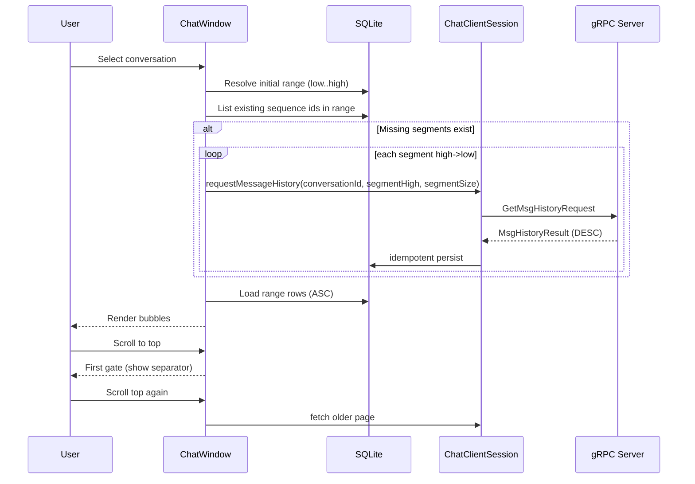

# Design: Client Conversation History Page (Scrollable + Dynamic Fetch)

## 1. Overview
This document explains the **implemented** frontend conversation history behavior in `ChatWindow` and related client classes. The timeline is rendered chat-style (newest near bottom), while older data is loaded on upward scrolling using sequence-based backfill.

The fetch pipeline is sequence-range driven:

1. compute target range from local known sequence state
2. detect missing sequence segments from SQLite
3. request server history only for missing segments
4. re-read full range from SQLite and render

The separation bar uses a two-step gate:

- first top-edge upward attempt: block and show prompt
- second upward attempt: trigger older-history fetch

## 2. Data Models and APIs

### 2.1 Runtime state (implemented)

`ChatWindow` keeps per-conversation in-memory state:

- `latestKnownSequenceId`
- `renderedHighSequenceId`
- `renderedLowSequenceId`
- `historyExpandedByUser`
- `historyExhausted`
- `isFetchingHistory`
- `separatorGateArmed`
- `separationBarVisible`

Auxiliary models:

- `SequenceSegment(lowInclusive, highInclusive)`
- `FetchResult(rows, low, high, historyExhausted, effectiveHigh)`

### 2.2 SQLite APIs used

Implemented sequence-based reads:

1. `listExistingSequenceIdsInRange(conversationId, start, end)`
2. `listMessagesBySequenceRange(conversationId, start, end)`
3. `getConversationCursor(userId, conversationId)`
4. `getMaxStoredSequenceId(conversationId)`

These are the primary APIs for dynamic range rendering.

### 2.3 Network API used

History pull uses:

- `GetMsgHistoryRequest(conversationId, beforeSequenceId, retriveMsgQuantity)`

Important semantic alignment:

1. server query is inclusive (`sequenceId <= beforeSequenceId`)
2. client range orchestration prevents duplicates by missing-segment planning + idempotent persistence

## 3. Current behavior by component

### 3.1 `ChatWindow`

Implemented behavior:

1. selection triggers async initial page load
2. initial range anchored by max of:
   - local cursor (`latest_message_sequence_id`)
   - local max stored sequence
3. missing segment planner runs high->low
4. one conversation allows one in-flight history request
5. stale async results are ignored when selection generation changed
6. message bubbles show sequence id for debug visibility

### 3.2 `ChatClientSession`

Implemented behavior:

1. `requestMessageHistory` validates auth/state and sends request
2. request quantity is normalized to positive and capped by 200
3. helper methods expose local sequence data to UI (`getLatestMessageSequenceId`, `getMaxStoredSequenceId`, range queries)

### 3.3 `ServerResponseHandler`

Implemented behavior:

1. persists `MsgHistoryResult` idempotently into SQLite
2. emits summary callback `onHistoryResultSummary(conversationId, startSequenceId, messageCount)`
3. triggers conversation data refresh callback

### 3.4 `DatabaseManager`

Implemented behavior:

1. sequence-range queries return deterministic slices
2. unique indexes enforce idempotent canonical writes
3. stored rows can be re-rendered in ascending sequence order

## 4. Implemented algorithms

### 4.1 Initial load

1. `latestKnown = session.getLatestMessageSequenceId(conversationId)`
2. `maxStored = session.getMaxStoredSequenceId(conversationId)`
3. `high = max(latestKnown, maxStored)`
4. `low = max(1, high - pageSize + 1)`
5. if `high <= 0`, mark exhausted
6. else run `fetchSequenceRangeWithBackfill(conversationId, high, pageSize)`

### 4.2 Missing-segment planner

Given `[low..high]` and `existingSequenceIds`:

1. scan from `high` down to `low`
2. group contiguous missing ids into segments
3. for each segment, request history with:
   - `beforeSequenceId = segment.highInclusive`
   - `retriveMsgQuantity = segment.size()`

### 4.3 In-flight request guard

One pending future per conversation:

- `pendingHistoryFetchByConversation.putIfAbsent(...)`
- duplicate in-flight request causes exception and short-circuit

This prevents ambiguous completion matching because history response has no request id.

### 4.4 Top-scroll gate

When scrollbar reaches top:

1. if fetching: ignore
2. if exhausted: show terminal separator
3. if not armed: arm gate and show separator text
4. if armed: disarm and trigger older fetch

### 4.5 Render policy

1. load rows by rendered sequence range
2. render ascending order
3. scroll mode:
   - `TO_BOTTOM` for initial/new-message cases
   - `TO_TOP` after loading older page
   - `KEEP_POSITION` when preserving viewport context

## 5. UX and data consistency rules

### 5.1 Timeline consistency

1. rendered content is always from SQLite (single local source)
2. network responses are persisted first, then UI re-reads local data
3. this avoids inconsistent direct-from-network rendering

### 5.2 Cursor interaction

1. catchup/live paths may advance cursor
2. history path should not regress forward cursor intent

### 5.3 Backfill boundaries

1. if `renderedLowSequenceId <= 1`, mark exhausted
2. if fetch returns empty older page, mark exhausted

## 6. Error and timeout behavior

Implemented behaviors:

1. history segment wait timeout: 8 seconds
2. on server error callback, all pending history futures complete exceptionally
3. if fetch fails, keep separator and current range; do not corrupt state

## 7. File responsibilities (current code)

1. `chat-client/src/main/java/com/coen6731/chat/client/ChatWindow.java`
   - state machine, top-scroll gate, range backfill, rendering
2. `chat-client/src/main/java/com/coen6731/chat/client/ChatClientSession.java`
   - history request send + local DB query helpers
3. `chat-client/src/main/java/com/coen6731/chat/client/ServerResponseHandler.java`
   - history result persistence + completion callback
4. `chat-client/src/main/java/com/coen6731/chat/client/DatabaseManager.java`
   - range queries + idempotent storage
5. `chat-client/src/main/java/com/coen6731/chat/client/ClientUiListener.java`
   - summary callbacks used as fetch completion signal

## 8. Known limitations and critical notes

1. History response has no request correlation id; per-conversation single in-flight guard is required.
2. Server history is descending and inclusive at `beforeSequenceId`; client orchestration must stay precise.
3. Large gaps require multiple segment requests and can increase latency.
4. No explicit server-side rate limiting for aggressive scroll-driven history pulls.

