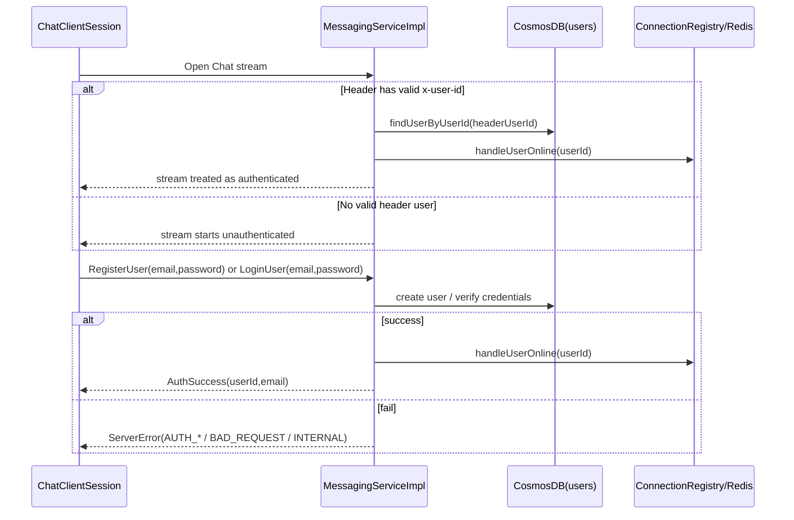

# Login/Register Feature Technical Design (Implemented)

## 0. Objective and Scope
This document explains the **implemented** login/register behavior in the current codebase.

In scope:

1. proto-level authentication payloads
2. server auth state transitions
3. client auth lifecycle and reconnect resume
4. Cosmos/SQLite persistence used by auth flow
5. key risks and boundaries

Out of scope (not implemented):

1. JWT/refresh tokens
2. email verification/password reset
3. strong password policy beyond non-empty checks

---

## 1. Feature Overview

### 1.1 Capability summary

Implemented capabilities:

1. register with `email + password`
2. login with `email + password`
3. authenticated users can send/catchup/history
4. reconnect may resume auth via `x-user-id` metadata

### 1.2 Workflow walkthrough

### 1.3 Data shape used by auth

#### A. Proto (`chat.proto`)

1. `LoginUser { email, password }`
2. `RegisterUser { email, password }`
3. `AuthSuccess { userId, email }`

#### B. Cosmos `users` document

Current fields used:

1. `id`
2. `userId`
3. `email`
4. `passwordHash`
5. `createdAt`
6. `updatedAt`

Passwords are stored only as hash.

#### C. Client SQLite `user_state`

Current local fields:

1. `user_id`
2. `email`
3. `user_name` (legacy fallback)

---

## 2. Implemented current behavior

### 2.1 Client auth behavior

`ChatClientSession` currently:

1. opens stream first, then performs auth events
2. `login()` / `register()` send event and block wait up to 15s
3. on auth success:
   - set `currentUserId` / `currentEmail`
   - set authenticated flag
   - initialize per-user SQLite DB
   - trigger catchup
4. on auth failure:
   - capture `lastAuthError`
   - notify UI auth failure

### 2.2 Server auth behavior

`MessagingServiceImpl` currently:

1. reads optional `x-user-id` from interceptor context on stream start
2. if header user resolves in DB -> start authenticated
3. otherwise start unauthenticated
4. supports events: login/register/send/heartbeat/catchup/history
5. rejects duplicate login/register when already authenticated (`BAD_REQUEST`)

### 2.3 Credential verification

`handleLoginUser`:

1. normalize email (`trim + lower`)
2. require non-empty email/password
3. find user by email
4. verify password via BCrypt `matches`
5. failure returns `AUTH_INVALID_CREDENTIALS`

`handleRegisterUser`:

1. normalize email
2. require non-empty email/password
3. reject existing email with `AUTH_EMAIL_ALREADY_EXISTS`
4. create user with BCrypt hash
5. failure returns `INTERNAL`

### 2.4 Auth transition effect

On auth success (`activateAuthenticatedSession`):

1. mark stream authenticated
2. update effective user identity
3. register/replace online session in `ConnectionRegistry`
4. send `AuthSuccess`

Duplicate-session behavior:

- old session is closed with `DUPLICATE_LOGIN`

---

## 3. Auth state and allowed operations

### 3.1 Stream-level states

1. `UNAUTHENTICATED`
2. `AUTHENTICATED`

### 3.2 Event access rules (implemented)

1. `HEARTBEATPING`: allowed in both states
2. `LOGINUSER` / `REGISTERUSER`: only meaningful in unauthenticated state
3. `OUTBOUNDMESSAGE`: requires authenticated state (otherwise send-ack `FAILED + AUTH_NOT_AUTHENTICATED`)
4. `CATCHUPREQUEST` / `GETMSGHISTORYREQUEST`: requires authenticated state (`ServerError AUTH_NOT_AUTHENTICATED`)

---

## 4. Reconnect and auth resume

### 4.1 Client behavior

After reconnect, if in-memory auth state exists:

1. client attaches metadata `x-user-id`
2. server may restore authenticated stream immediately
3. client sends catchup once connection is healthy

### 4.2 Server behavior

1. header user lookup is DB-backed (`findUserByUserId`)
2. success path enters authenticated state without password re-check
3. failure path remains unauthenticated

---

## 5. Error model used by auth flow

Auth-related server error codes:

1. `AUTH_INVALID_CREDENTIALS`
2. `AUTH_EMAIL_ALREADY_EXISTS`
3. `AUTH_NOT_AUTHENTICATED`
4. `BAD_REQUEST`
5. `INTERNAL`

Client-side handling:

1. `ServerResponseHandler` routes `AUTH_*`, `BAD_REQUEST`, `INTERNAL` to auth-failure callback
2. `ChatClientSession` resolves latch and stores `lastAuthError`

---

## 6. Security boundaries and critical risks

### 6.1 Implemented controls

1. password hashing with BCrypt
2. server-side auth gate for send/catchup/history
3. sender identity bound to effective authenticated user, not client-declared sender field

### 6.2 Critical risk in current implementation

`x-user-id` resume is a weak trust model:

1. header value is treated as identity pointer if user exists in DB
2. no token signature
3. no expiry/revocation model
4. no replay protection

This should be considered temporary/convenience behavior.

---

## 7. Compatibility and migration notes

1. proto field names are already active in current runtime.
2. SQLite keeps `user_name` fallback for old local DB compatibility.
3. no dedicated server-side migration framework for Cosmos auth schema changes.

---

## 8. Recommended validation checklist (code-aligned)

1. register success path
2. register duplicate email path
3. login success path
4. login wrong-password path
5. unauthenticated send rejected
6. unauthenticated catchup/history rejected
7. reconnect with `x-user-id` resumes session
8. duplicate login replaces old session and closes it

