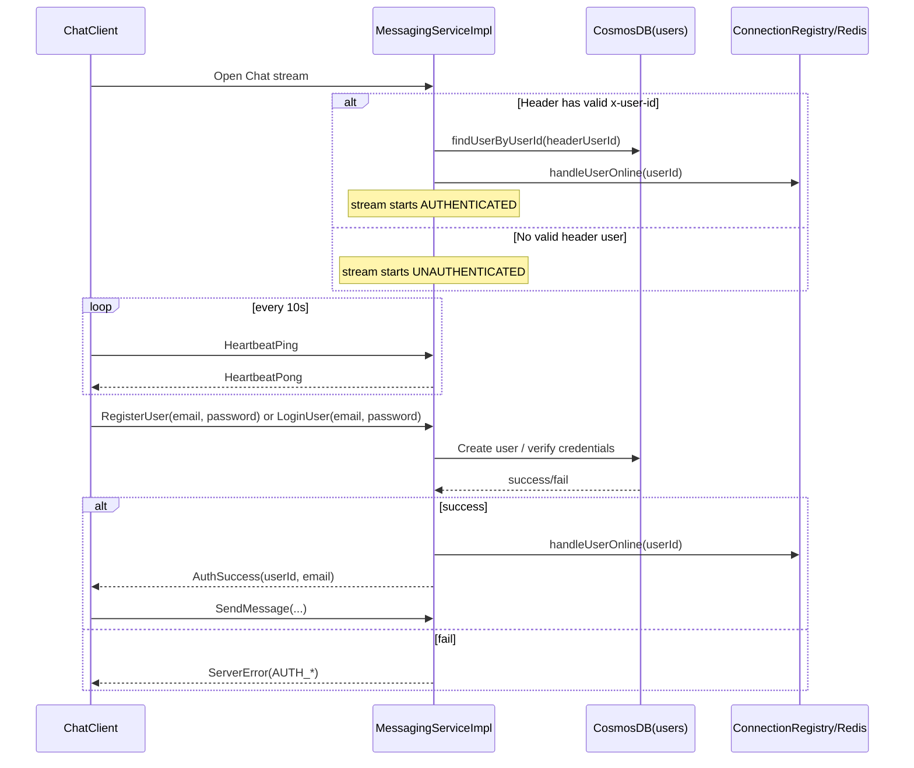

# Login/Register Feature Technical Design

## 0. Objective and Scope
This document defines the current login/register design for the chat system, aligned with the implemented code. The goal is credential-based authentication (`email + password`) while preserving messaging, heartbeat, reconnect, and catchup behavior.

In scope:
1. Protocol (`proto`) changes.
2. Client/server implementation changes.
3. Cosmos and SQLite schema changes.
4. Compatibility and risk controls.

Out of scope:
1. JWT/refresh token.
2. Email verification and password reset.
3. Strong password policy (only minimal validation in this phase).

---

## 1. Feature Overview

### 1.1 Capability Summary
The system provides two authentication flows before chat usage:
1. Register: user submits `email/password`, account is created, then logged in.
2. Login: user submits `email/password`, credentials are verified.
3. Only authenticated users can send outbound messages, request catchup, and request history.
4. Reconnect can resume authenticated state using `x-user-id` metadata when available.

### 1.2 New Workflow Walkthrough

### 1.3 Schema Changes

#### A. Proto changes (`chat-proto/src/main/proto/chat.proto`)
1. `LoginUser` fields: `email`, `password`.
2. `RegisterUser` fields: `email`, `password`.
3. `AuthSuccess` exists in `ServerEvent`:
   - `userId`
   - `email`
4. `ClientEvent` also includes `CatchupRequest` and `GetMsgHistoryRequest`.

#### B. Cosmos `users` document
Current implemented shape:
1. `id` (`userId`)
2. `userId`
3. `email`
4. `passwordHash`
5. `createdAt`
6. `updatedAt`

Note: no plaintext password storage.

#### C. Client SQLite (`chat-client/db/init.sql`)
Current implemented model:
1. `user_state`: `user_id`, `email`, `user_name`
2. Per-conversation sync cursor in `local_conversation_cursor.latest_message_sequence_id`

Migration strategy:
1. Keep `user_name` temporarily for backward compatibility.
2. Read preference: `email` first, fallback to `user_name`.

---

## 2. Existing Workflow and Current Implementation

### 2.1 Client current state
1. Client UI supports both login and register.
2. `ChatClientSession.connect()` attaches `x-user-id` only when already authenticated and `currentUserId` is available.
3. `sendMessage` is gated by authenticated state.
4. On reconnect, client retains auth state in memory and sends catchup after reconnect becomes healthy.

Key code:
1. `chat-client/src/main/java/com/coen6731/chat/client/ChatClient.java`
2. `chat-client/src/main/java/com/coen6731/chat/client/ChatClientSession.java`
3. `chat-client/src/main/java/com/coen6731/chat/client/DatabaseManager.java`

### 2.2 Server current state
1. `UserIdInterceptor` allows anonymous streams and forwards optional `x-user-id` into gRPC context.
2. `MessagingServiceImpl` handles `LOGINUSER`, `REGISTERUSER`, `OUTBOUNDMESSAGE`, `CATCHUPREQUEST`, `GETMSGHISTORYREQUEST`, and `HEARTBEATPING`.
3. If `x-user-id` resolves to a user, the stream starts authenticated.
4. Registration/login use the Cosmos `email/passwordHash` model with BCrypt verification on login.

Key code:
1. `chat-server/src/main/java/com/coen6731/chat/server/UserIdInterceptor.java`
2. `chat-server/src/main/java/com/coen6731/chat/server/MessagingServiceImpl.java`
3. `chat-server/src/main/java/com/coen6731/chat/server/CosmosDBHandler.java`

### 2.3 Critical gaps to target
1. Header-based resume (`x-user-id`) is convenient but weak if metadata is forgeable.
2. Error handling is split between `SendMessageAck(FAILED)` and `ServerError`, so client behavior must stay explicit.
3. Catchup/history semantics must remain aligned across server and client pagination logic.
4. Multi-instance auth/session replacement behavior requires integration validation.

---

## 3. New Design by Component

### 3.1 `chat-proto` (Protocol Layer)

Design:
1. `LoginUser`/`RegisterUser` use credential payload (`email`, `password`).
2. `AuthSuccess` exists in `ServerEvent`.
3. Keep `ServerError.code` string-based in this phase for fast rollout.

Standard auth error codes:
1. `AUTH_INVALID_CREDENTIALS`
2. `AUTH_EMAIL_ALREADY_EXISTS`
3. `AUTH_NOT_AUTHENTICATED`
4. `BAD_REQUEST`

### 3.2 `chat-server`

#### 3.2.1 `UserIdInterceptor` (Interceptor)

Design:
1. Allow missing `x-user-id` for anonymous stream bootstrap.
2. If header exists, inject to context; if missing, inject null/empty.
3. Access control is enforced at event-level checks in `MessagingServiceImpl`.

#### 3.2.2 `MessagingServiceImpl` (Event State Machine)

Per-stream state machine:
1. `UNAUTHENTICATED`
2. `AUTHENTICATED`

Allowed events:
1. `UNAUTHENTICATED`: `LOGINUSER`, `REGISTERUSER`, `HEARTBEATPING`.
2. `AUTHENTICATED`: `OUTBOUNDMESSAGE`, `CATCHUPREQUEST`, `GETMSGHISTORYREQUEST`, `HEARTBEATPING`.

Auth success transition:
1. Resolve authenticated `userId` from DB.
2. Call `connectionRegistry.handleUserOnline(userId, responseObserver)`.
3. Bind stream runtime state: `state=AUTHENTICATED`, `effectiveUserId=userId`.
4. Return `AuthSuccess(userId, email)`.
5. The same transition also occurs at stream start when `x-user-id` header is valid.

#### 3.2.3 `CosmosDBHandler` (Data Access Layer)

New methods:
1. `createUser(email, passwordHash): UserRecord`
2. `findUserByEmail(email): Optional<UserRecord>`
3. `findUserByUserId(userId): Optional<UserRecord>`

Password handling:
1. Use BCrypt (`spring-security-crypto`) in the current implementation.
2. Never log raw password or full hash values.

#### 3.2.4 `ConnectionRegistry` / `RedisHandler` (Online State)

Core rule:
1. A user is considered online only after `AUTHENTICATED` transition.
2. Pre-auth streams must not create or renew Redis online routing keys.

No major API redesign needed; only invocation timing changes.

### 3.3 `chat-client`

#### 3.3.1 `ChatClient` (UI Flow)

Startup flow:
1. Start Swing UI and create `ChatClientSession`.
2. User performs login/register from the UI.
3. Client sends auth event and waits for `AuthSuccess`.
4. Chat actions are available only after authenticated state is established.

#### 3.3.2 `ChatClientSession` (Session Management)

Design:
1. Stream can be opened before identity is known.
2. Keep client-side `authState` (`UNAUTHENTICATED`/`AUTHENTICATED`).
3. `sendMessage` must guard on `AUTHENTICATED`.
4. Reconnect keeps authenticated state in memory (unless closing), attaches `x-user-id`, and triggers catchup after reconnect.

#### 3.3.3 `ServerResponseHandler` (Response Dispatch)

Add handling for `AUTHSUCCESS`:
1. Persist `userId/email` into SQLite.
2. Flip session auth state to authenticated.

Keep `SERVERERROR` mapping readable for `AUTH_*` codes.

### 3.4 SQLite / `DatabaseManager` (Local State)

Changes:
1. `updateUserState(userId, email)`.
2. Add `getEmail()`.
3. Keep lightweight schema migration at startup (`ensureSchema`) including cursor compatibility updates.

---

## 4. Heartbeat and 3-Strike Retry: Detailed Logic

### 4.1 Should `UNAUTHENTICATED` stream allow heartbeat?
Yes. It should allow heartbeat for connection liveness, with strict isolation from online presence.

Rules:
1. `UNAUTHENTICATED + HeartbeatPing` is valid; server responds `HeartbeatPong`.
2. `UNAUTHENTICATED` heartbeat must not call `connectionRegistry.updateHeartbeat(userId)` because no authenticated `userId` exists.
3. `UNAUTHENTICATED` heartbeat must not renew Redis online key.

Reason:
1. It keeps stream health detection intact.
2. It avoids false online status and routing pollution.

### 4.2 3-strike retry behavior across auth states
Client behavior should remain transport-centric:
1. Missing 3 consecutive pongs triggers reconnect regardless of auth state.
2. After reconnect, client does not force `UNAUTHENTICATED` if prior auth state remains in memory.
3. The reconnect path attempts header-based resume via `x-user-id`, then catchup.

Server behavior:
1. For `UNAUTHENTICATED` streams, timeout cleanup closes only that transient stream; no registry cleanup is needed.
2. For `AUTHENTICATED` streams, existing cleanup path remains: remove connection map + remove Redis online key + close session.

### 4.3 Transition from `UNAUTHENTICATED` to `AUTHENTICATED`
When auth succeeds on an existing stream:
1. Create or obtain `userId`.
2. Immediately register online state:
   - `connectionRegistry.handleUserOnline(userId, responseObserver)`
   - internally writes Redis route `user:online:{userId} -> instanceId:sessionId`.
3. Start authenticated heartbeat behavior:
   - future `HeartbeatPing` now updates in-memory session heartbeat and renews Redis TTL.
4. Return `AuthSuccess` to client as the only source of truth for entering chat mode.

### 4.4 Duplicate login during transition
If another node/session logs in the same account concurrently:
1. `handleUserOnline` replacement semantics stay unchanged.
2. Old session receives `DUPLICATE_LOGIN` and is closed.
3. New authenticated stream becomes the canonical online session.

---

## 5. Risk Points

1. Misunderstanding interceptor behavior can lead to incorrect auth/security assumptions.
2. Pre-auth heartbeat accidentally updates Redis TTL: causes false-online users.
3. Missing `AuthSuccess`: client cannot deterministically switch to authenticated mode.
4. Inconsistent error codes: client retry UX becomes ambiguous.
5. Proto update without regenerating stubs: runtime incompatibility.
6. SQLite migration mishandled: existing local DB startup failures.
7. Sensitive logging: password leakage risk in logs.
8. Duplicate-login race not validated in multi-instance testing.

---

## 6. Recommended Implementation Order

1. Keep proto and generated stubs synchronized across modules.
2. Validate server auth state machine behavior (anonymous stream, login/register, header resume).
3. Validate Cosmos credential APIs + password hashing behavior.
4. Validate client auth-state gating and reconnect/catchup behavior.
5. Validate SQLite migration and compatibility reads.
6. Integration tests:
   - register success/failure
   - login success/failure
   - unauthenticated send rejection
   - heartbeat + 3-strike reconnect (both auth states)
   - duplicate login replacement

---

## 7. Definition of Done

1. New user can register and immediately chat.
2. Existing user can login with email/password.
3. Unauthenticated `SendMessage` is rejected with `AUTH_NOT_AUTHENTICATED`.
4. Heartbeat works pre-auth and post-auth without false online routing.
5. 3-strike reconnect works in both auth states.
6. Duplicate login replacement works across instances.
7. No plaintext password storage or password logging.
8. No regression in current messaging and heartbeat behavior.
