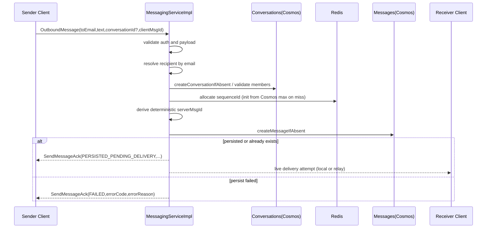
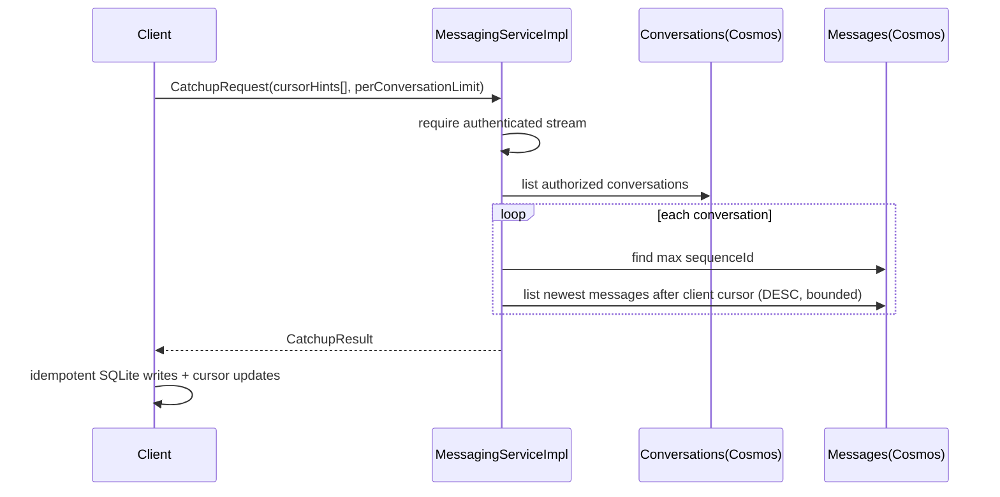
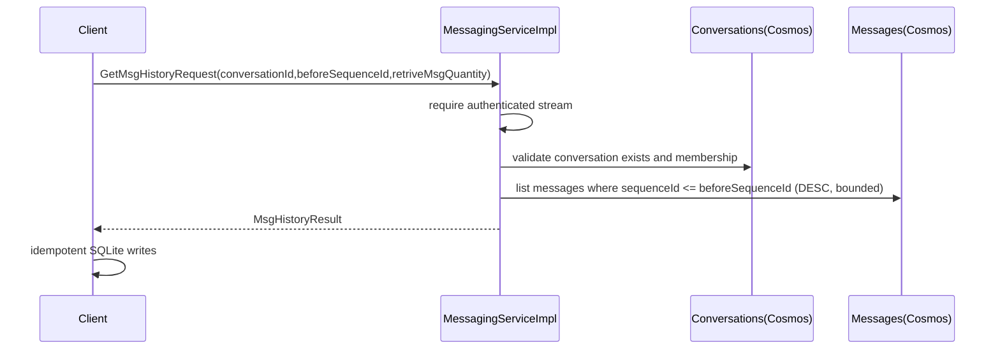

# Message Persistency v2 - Design (Implemented)

## 1. Overview

This document explains the **implemented** message persistence model:

1. per-conversation monotonic `sequenceId`
2. deterministic message idempotency via `serverMsgId`
3. Redis-assisted sequence allocation with Cosmos fallback
4. durable storage in Cosmos + local idempotent caching in SQLite
5. catchup/history recovery around persisted data

This is not a pre-implementation proposal; it documents current production code behavior.

---

## 1.2 Send / persist / delivery flow

Key semantics:

1. ack success means message is persisted (or idempotently resolved), not guaranteed recipient live-consumed.
2. live relay failure can still be recovered by catchup/history.

---

## 1.3 Catchup flow (implemented)

---

## 1.4 History flow (implemented)

---

## 2. Data models and invariants

### 2.1 Server-side entities

#### 2.1.1 ConversationRecord

Current fields:

- `conversationId`
- `memberUserIds`
- `createdAtMs`
- `updatedAtMs`
- `lastMessageAtMs`

Current send path creates 2-member conversations, but model itself is list-based.

#### 2.1.2 MessageRecord

Current fields:

- `serverMsgId`
- `clientMsgId`
- `conversationId`
- `sequenceId`
- `senderUserId`
- `recipientUserId`
- `text`
- `sentAtMs`
- `status`
- `createdAtMs`
- `updatedAtMs`

### 2.2 Sequence allocation invariant

Implemented sequence allocator:

1. Redis key: `conversation:latest_msg_sequenceId:{conversationId}`
2. read key; if missing:
   - query Cosmos max sequence for that conversation
   - `setIfAbsent(redisKey, durableMax)`
3. call Redis `INCR` and use returned value

Expected invariant:

- sequence increases monotonically per conversation under healthy Redis behavior.

### 2.3 Idempotency invariant

Server idempotency key:

- `serverMsgId = UUID.nameUUIDFromBytes((senderUserId + "::" + clientMsgId).getBytes(UTF_8))`

Persistence idempotency behavior:

1. `createMessageIfAbsent` on Cosmos
2. if conflict (409), load existing by `serverMsgId`
3. ack/payload built from persisted/existing canonical record

---

## 3. Implemented component responsibilities

### 3.1 `MessagingServiceImpl`

1. validates send payload and auth
2. orchestrates recipient lookup, conversation resolution, sequence allocation
3. persists message and emits ack
4. attempts live delivery local-first, then relay
5. handles catchup/history APIs

### 3.2 `CosmosDBHandler`

1. CRUD/query for users, conversations, messages
2. max-sequence query
3. newest-after-sequence query (catchup)
4. history-by-before-sequence query
5. conversation touch (patch fallback upsert)

### 3.3 `RedisHandler`

1. online presence keys (TTL)
2. sequence keys (`incrementConversationSequence`)
3. cross-replica relay streams (publish/consume/ack)

### 3.4 Client persistence path

Across `ChatClientSession` + `ServerResponseHandler` + `DatabaseManager`:

1. outbound provisional row inserted before network send
2. success ack updates provisional row to canonical fields
3. failed ack deletes provisional row
4. inbound/catchup/history all use idempotent canonical insert path
5. per-conversation cursor maintained in SQLite

---

## 4. Detailed persistence behaviors

### 4.1 Outbound provisional lifecycle

1. on send intent: insert `OUTBOUND` row with `PENDING_ACK`
2. on success ack: fill `server_msg_id`, `conversation_id`, `sequence_id`, set persisted status
3. on failed ack: delete provisional row

### 4.2 Canonical idempotent storage

`DatabaseManager.upsertCanonicalMessage(...)` uses insert-ignore + unique indexes to avoid duplicates.

SQLite uniqueness used:

1. `(conversation_id, server_msg_id)` where `server_msg_id` non-empty
2. `(conversation_id, sequence_id)` where `sequence_id > 0`

### 4.3 Cursor advancement behavior

Implemented advancement:

1. on inbound/success ack/catchup, cursor advances only if new sequence is higher
2. history write path does not intentionally move forward cursor

---

## 5. Ack and delivery semantics

### 5.1 Ack statuses actively used by server

1. `PERSISTED_PENDING_DELIVERY`
2. `FAILED`

`DELIVERED_LIVE` exists in proto but is not currently emitted in send ack path.

### 5.2 Live delivery outcomes

1. local session online -> direct push
2. remote session online -> relay publish to target instance stream
3. no matching session -> no live push; recovery relies on persisted catchup/history

---

## 6. Failure handling and backpressure

### 6.1 Send executor overload

- queue capacity: 30000
- on rejection: immediate failed ack with `OVERLOADED`

### 6.2 Persistence failure

- persistence exceptions map to `PERSISTENCE_FAILED` or `INTERNAL` failed acks

### 6.3 Relay failure boundary

- relay/logical live delivery failures do not roll back persisted message
- eventual client recovery relies on catchup/history

---

## 7. Critical consistency notes

1. Redis sequence key is performance aid; Cosmos max query is fallback alignment source.
2. Client timeline consistency comes from SQLite re-read after persistence, not direct event rendering.
3. History query is inclusive at `beforeSequenceId`; callers must handle overlap safely.
4. In current implementation there is no explicit dedupe token for history requests; dedupe relies on idempotent persistence/indexes.

---

## 8. Known gaps and future hardening

1. No tokenized security for header-based auth resume.
2. No relay pending-claim recovery strategy documented in code.
3. No explicit API versioning field for persistence-contract evolution.
4. No end-to-end exactly-once delivery guarantee; design is persisted-at-least-once + idempotent reconciliation.

