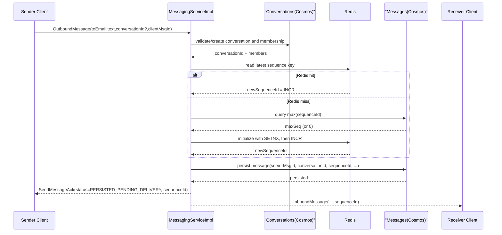
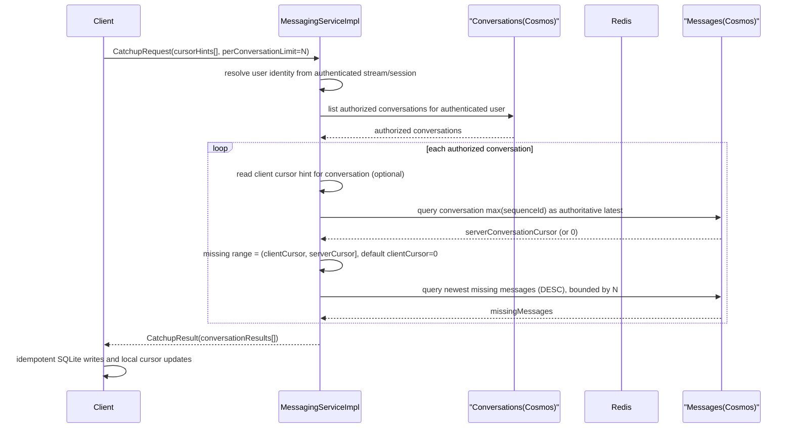
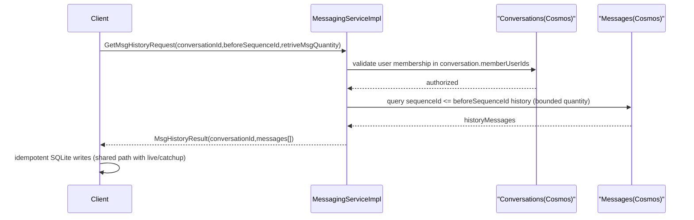

# Message Persistency v2 - Design (Catchup + History)

## 1. Overview

v2 addresses a direct reliability issue: when users are offline, messages may already be persisted in Cosmos but missing from the client local store. After login or reconnect, the missing messages must be synchronized safely.

Core approach:

1. Each conversation has its own monotonic `sequenceId`.
2. The server persists authoritative sequence state via Cosmos messages, and uses Redis for fast allocation on send.
3. The client maintains per-conversation local cursor hints.
4. Catchup provides a fast missing-window sync; deeper back-scroll uses `GETMSGHISTORYREQUEST`.

### 1.2 v2 send / persist / delivery flow

Notes:

1. Server resolves a valid `conversationId` first, then allocates `sequenceId`, then persists and acks.
2. Sequence allocation uses Redis; if key is missing, server backfills from Cosmos `max(sequenceId)` and continues.
3. Successful ack means persisted, not guaranteed live recipient delivery.

### 1.3 v2 catchup flow (per conversation, bounded by N)

API field-by-field details are intentionally documented in `docs/catchup_history_message_design.md`.

Notes:

1. For each conversation, server compares client cursor hint with authoritative latest from Cosmos.
2. Missing range is conceptually `(clientCursor, serverCursor]`.
3. Current proto does not include `appliedClientCursor`; client advances based on persisted message sequence values in response.
4. Each conversation returns at most `N` messages to bound payload size.

### 1.4 v2 `GetMsgHistoryRequest` flow

API request/response examples are documented in `docs/catchup_history_message_design.md`.

Notes:

1. History only fetches older messages and does not perform gap comparison logic.
2. After catchup, client can continue back-scroll via `GetMsgHistoryRequest`.

## 2. Data Models and Contracts

### 2.1 RPC contract ownership

This document focuses on persistence and storage logic, not full API field documentation.

- Full API and payload semantics are documented in:
  - `docs/catchup_history_message_design.md`
- Wire schema source of truth remains:
  - `chat-proto/src/main/proto/chat.proto`

Contract constraints relied upon by this document:
1. Catchup is per conversation (`cursorHints`, `perConversationLimit`).
2. History paging uses `beforeSequenceId` + `retriveMsgQuantity`.
3. Canonical message payload includes `sequenceId`.

### 2.2 Server-side data model (Cosmos + Redis)

#### 2.2.1 `ConversationRecord`

Conversation membership is modeled as a list:

- `id` / `conversationId`
- `memberUserIds: string[]`
- `createdAtMs`
- `updatedAtMs`
- `lastMessageAtMs`

For current 1:1 behavior, the list length is two in the send path.

#### 2.2.2 `MessageRecord`

- `id = serverMsgId`
- `conversationId`（partition key）
- `sequenceId`
- `clientMsgId`
- `senderUserId`
- `recipientUserId`
- `text`
- `sentAtMs`
- `status`

#### 2.2.3 Authoritative cursor and Redis sequence key

Sequence allocation key is stored in Redis and uses Redis atomic increment:

- Redis key: `conversation:latest_msg_sequenceId:{conversationId} => sequenceId`
- On Redis miss:
  1. Query Cosmos `max(sequenceId)` for that conversation
  2. Use `SETNX` (`setIfAbsent`) to backfill safely.
  3. Execute `INCR` to allocate next sequence and continue

### 2.3 Client SQLite

For per-conversation local cursor hints, client uses:

- `local_conversation_cursor`
  - `user_id TEXT NOT NULL`
  - `conversation_id TEXT NOT NULL`
  - `latest_message_sequence_id INTEGER NOT NULL DEFAULT 0`
  - `updated_at_ms INTEGER NOT NULL`
  - `PRIMARY KEY(user_id, conversation_id)`

`messages` table additions:

- `sequence_id INTEGER`
- unique index: `(conversation_id, server_msg_id)` when `server_msg_id` is non-empty
- unique index: `(conversation_id, sequence_id)` when `sequence_id` is non-null and > 0

## 3. Implemented system responsibilities

### 3.1 `MessagingServiceImpl`

Implemented responsibilities:
1. Handles login/register/outbound/heartbeat/catchup/history on one stream.
2. Allocates `sequenceId`, persists message, and returns ack with `sequenceId`.
3. Enforces auth + membership validation for catchup/history access.

### 3.2 `CosmosDBHandler`

Implemented responsibilities:
1. Stores conversation membership (`memberUserIds`) and message records.
2. Provides `findMaxSequenceId` for authoritative sequence lookup.
3. Provides catchup/history query methods by conversation and sequence range.

### 3.3 Client persistence path

Implemented responsibilities across `ChatClientSession` / `ServerResponseHandler` / `DatabaseManager`:
1. Trigger catchup on login success and reconnect success.
2. Persist live/catchup/history payloads idempotently.
3. Maintain per-conversation local cursor in SQLite.

## 4. Implementation Details

This section documents expected behavior and key constraints for service/client data flow.

### 4.1 API reference boundary

To avoid documentation duplication:
1. API-level request/response field definitions live in `docs/catchup_history_message_design.md`.
2. This document keeps only persistence-critical behavior and invariants.
3. Proto remains the canonical contract source (`chat-proto/src/main/proto/chat.proto`).

### 4.2 Server expected behavior (Service & DB)

#### 4.2.1 Safe sequence ID allocation (Redis + backfill)

**Workflow (monotonic per conversation):**

1. On send, allocate sequence via Redis increment.
2. On cache miss, query Cosmos `max(sequenceId)` first, backfill Redis with `setIfAbsent`, then increment.

#### 4.2.2 Catchup request handling logic

**Workflow:**

1. Require authenticated stream and enumerate authorized conversations from DB.
2. For each conversation, read client cursor hint (default 0), then compare with Cosmos latest sequence.
3. If missing exists, fetch newest missing messages (`DESC`) bounded by per-conversation limit.
4. Current proto does not return `applied_client_cursor`; client derives progress from returned messages.

#### 4.2.3 Message persistence and delivery (sending and routing)

**Workflow:**

1. Sender can connect to any instance and send `OutboundMessage`.
2. Server validates request and allocates `Next Sequence ID`.
3. Server persists message with `sequence_id` into Cosmos.
4. Server returns `Ack` to sender with `sequence_id`.
5. Deliver `InboundMessage` (with `sequenceId`) to recipient session if online (local or relayed).

### 4.3 Client expected behavior (Local DB & logic)

#### 4.3.1 Client model and cursor storage

**Expected Behavior:**

1. **Per-conversation cursor**: local mapping `(userId, conversationId) -> latest_message_sequence_id`.
2. **Unique sequence constraints**: unique index on `(conversation_id, sequence_id)` for dedupe and ordering.
3. **Idempotent write**: live/catchup/history should all use idempotent local write paths.

#### 4.3.2 Offline compensation trigger timing (Catchup)

**Expected Behavior:**

1. After first auth success or reconnect success, client sends catchup using local cursor hints.
2. Client may show syncing state while catchup result is pending.
3. Client persists returned messages and advances local cursors based on actual returned sequence values.

#### 4.3.3 Live message ordering tolerance and cursor advancement

**Expected Behavior:**
When receiving `InboundMessage`:

1. Persist message locally.
2. Compare incoming `sequenceId` to local cursor:
   - **Simple advancement mode**: if `sequenceId > currentCursor`, advance cursor.
   - Any missed gaps can be repaired by next catchup.

#### 4.3.4 History fetch timing

**Expected Behavior:**
When user scrolls to top of loaded conversation data, client can request older history:

1. Use current top message `sequence_id` as `beforeSequenceId`.
2. Persist returned older messages. _(History enriches old data and should not regress forward sync cursor.)_
